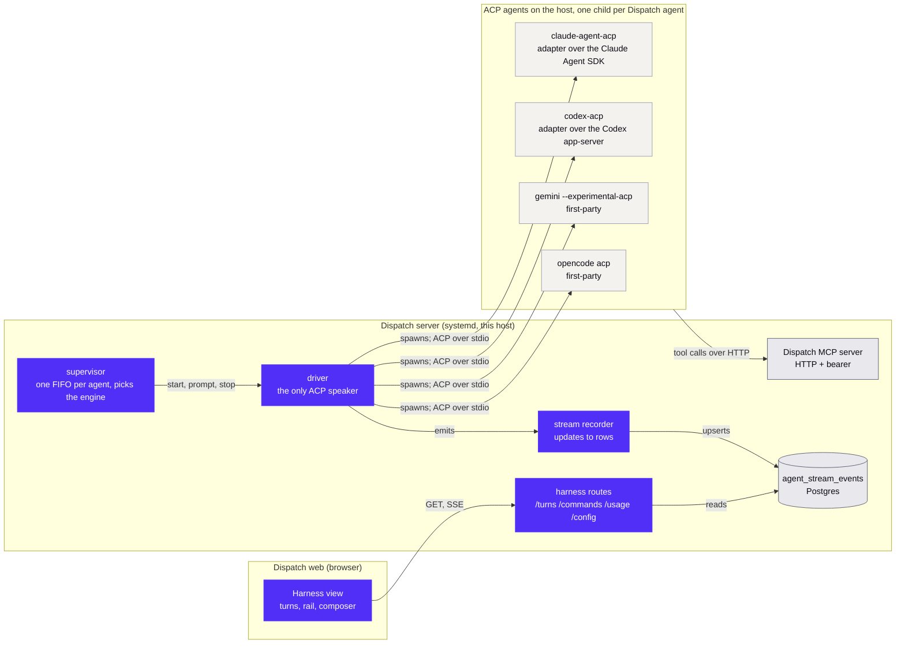

# Dispatch Harness: four engines over the Agent Client Protocol

**Status:** approved design, spec not yet reviewed by author. **Date:** 2026-09-07.
**Branch:** `dsh-harness-deploy`, toward PR #1067 on `selfcontained/dispatch`.
**Decides:** Nii Yeboah (scope). **Merges:** Brad Harris.

## Summary

Dispatch's `dispatch` agent type ("Dispatch Harness") runs a coding agent as a child process over the Agent Client Protocol and renders the session as turns in the Harness view. Four engines ship: Claude Code through `claude-agent-acp`, Codex through `codex-acp`, Gemini CLI and OpenCode through their own first-party ACP modes. Each engine is the CLI install and login already on the server: no provider key in Dispatch, no vendor Dispatch did not already run. The engine is the first segment of the agent's model id (`claude/...`, `codex/...`, `gemini/...`, `opencode/...`). Everything Dispatch draws is fed by ACP session updates in the released v1 schema; where an engine does not publish something (a plan, usage, model options) the view says so instead of showing an empty control. This change swaps the child process, adds the engine seam, and deletes the code that assumed a different child; the view, the driver, the recorder, and the turn model keep their shape, and every transition in the view moves on one set of motion tokens.

## Stakeholders and open questions

| ID  | Question                                                                              | Owner | Status                                                                                                                                                                                                                                                                       |
| --- | ------------------------------------------------------------------------------------- | ----- | ---------------------------------------------------------------------------------------------------------------------------------------------------------------------------------------------------------------------------------------------------------------------------- |
| Q1  | Which versions does the runbook pin?                                                  | Nii   | decided: exact pins that install under this host's 7-day npm freshness cutoff today, `claude-agent-acp@0.70.0`, `codex-acp@1.7.0`, `@google/gemini-cli@0.57.0`, `opencode-ai@1.18.29`; a follow-up bumps to `0.75.1`, `1.10.0`, `0.58.0` once the window clears              |
| Q2  | The server ships as one Bun binary with no `node_modules`; where do the engines live? | Brad  | decided for this PR: host installs found through `DISPATCH_*_BIN`, the story `claude`, `codex`, and `opencode` already have in Dispatch; bundling the two adapters is a follow-up if Brad wants it                                                                           |
| Q3  | What happens to Settings, Agents, Usage budgets?                                      | Nii   | decided: one USD row per engine that reports cost, Claude and OpenCode; Codex shows tokens without a bar, Gemini shows "not reported over ACP"                                                                                                                               |
| Q4  | Should the Harness view eventually back the `claude`, `codex`, and `opencode` types?  | Brad  | closed: out of scope and not a design target; the Harness is its own type and the tmux types are unchanged                                                                                                                                                                   |
| Q5  | Logins on the server, run as the service user                                         | Nii   | decided: Codex through `codex login --device-auth` on the ChatGPT plan; Gemini through `NO_BROWSER=true gemini` with the company Google account; OpenCode's provider is deferred, so its live smoke is skipped and it ships on the fake-agent e2e until a provider is chosen |

## Why

Two facts, and the design follows from both.

The Harness view is Dispatch code. The turns, the activity rail, live thinking, the queue with Send now and Stop, question cards, inline shortcut pins: all of it renders `agent_stream_events` rows and knows nothing about which agent produced them. The driver speaks standard ACP only, names its child binary in one place, and depends on no protocol extensions.

The four engines are what Dispatch already drives in tmux panes (`claude`, `codex`, `opencode`) or what the company already pays for (Gemini through its Google plan). Each speaks ACP, first-party or through an adapter maintained by the ACP organization, and each uses the host CLI's own login. Pointing the driver at them gives the Harness view to the agents people use, with no API key on the server, and it makes the seam real: an engine is a row in a table, and the differences between rows are the list in Engines below, nothing hidden.

## What

### Engines

The engine is the first segment of the agent's model id. `claude/default` is the default for a new `dispatch` agent. `splitModelId` (already on the branch) yields `{ engine, model }` at the first slash, so OpenCode's own `provider/model` ids survive as the model half (`opencode/anthropic/claude-sonnet-5`). A model id without a slash is an error at create time. The create dialog groups models by engine.

`agents/harness/agent-spec.ts` holds one spec per engine. The supervisor reads the engine from the agent's model and hands the driver the spec; nothing else in the server branches on the engine, and the web learns an engine's capabilities from the session (which updates arrive) rather than from a hardcoded list.

|                           | `claude`                                                                     | `codex`                                                                                                                      | `gemini`                                                                                                  | `opencode`                                                                                    |
| ------------------------- | ---------------------------------------------------------------------------- | ---------------------------------------------------------------------------------------------------------------------------- | --------------------------------------------------------------------------------------------------------- | --------------------------------------------------------------------------------------------- |
| Runs                      | `claude-agent-acp` over the Claude Agent SDK                                 | `codex-acp` over the Codex app-server, bundling `@openai/codex`                                                              | `gemini --experimental-acp`                                                                               | `opencode acp`                                                                                |
| Binary setting            | `claudeHarnessBin`, default `claude-agent-acp`                               | `codexHarnessBin`, default `codex-acp`                                                                                       | `geminiBin`, default `gemini`                                                                             | `opencodeBin` (existing), default `opencode`                                                  |
| Spawn arguments           | `--dangerously-skip-permissions`                                             | none                                                                                                                         | `--experimental-acp`, `--model <model>` when not `default`                                                | `acp`                                                                                         |
| Environment               | `CLAUDE_CODE_EXECUTABLE=<config.claudeBin>`                                  | `INITIAL_AGENT_MODE=agent-full-access`, `NO_BROWSER=1`, `CODEX_PATH=<config.codexBin>` only when `DISPATCH_CODEX_BIN` is set | none                                                                                                      | none                                                                                          |
| Full access               | the flag, the tmux `claude` type's posture                                   | the env var, the tmux `codex` type's `--dangerously-bypass-approvals-and-sandbox`                                            | `session/set_mode` to `yolo`, one of the four modes it advertises (`default`, `autoEdit`, `yolo`, `plan`) | the driver's `requestPermission` handler answers `allow_once` or `always`, as it already does |
| Login                     | `~/.claude`                                                                  | `~/.codex/auth.json`                                                                                                         | Google account or `GEMINI_API_KEY`                                                                        | `~/.local/share/opencode/auth.json`                                                           |
| Persona                   | `session/new` `_meta.systemPrompt: { append }` onto the `claude_code` preset | first prompt's leading block                                                                                                 | first prompt's leading block (`GEMINI_SYSTEM_MD` replaces the whole prompt, so it is not used)            | first prompt's leading block                                                                  |
| Model switch              | `session/set_config_option`                                                  | `session/set_config_option`                                                                                                  | fixed at create; `/model` disabled with the reason                                                        | `session/set_config_option` (it publishes `model`, `thought_level`, `mode`)                   |
| Plan (tasks strip)        | yes                                                                          | yes                                                                                                                          | no                                                                                                        | no                                                                                            |
| Usage                     | tokens, context size, USD cost                                               | tokens, context size                                                                                                         | none over ACP                                                                                             | tokens, context size, USD cost                                                                |
| Subagents                 | nested, after `_meta["subagent-transcript"]: true` at `initialize`           | one step (native kinds are draft)                                                                                            | one step (native kinds are draft)                                                                         | one step                                                                                      |
| Slash commands            | yes                                                                          | yes                                                                                                                          | yes                                                                                                       | yes                                                                                           |
| Resume (`session/resume`) | yes                                                                          | yes                                                                                                                          | yes                                                                                                       | yes                                                                                           |

`HOME` is inherited for every engine, so each CLI finds its own login. Dispatch sets no other vendor variable.

### Session setup

The driver negotiates ACP protocol version 1, the SDK's root export. `initialize` declares `clientCapabilities.fs` read and write `false` (unchanged) and, for the Claude engine only, `_meta: { "subagent-transcript": true }`.

`session/new` and `session/resume` carry `mcpServers`, Dispatch's HTTP MCP server with the agent's bearer token (unchanged), and for the Claude engine `_meta.systemPrompt: { append: <persona> }`. The persona is `buildHarnessPersona` (today's `buildDshPersona`): launch guidance, the Harness chat rule, the slash rule, then the review brief or the active personality. For the other three engines the same text is the leading block of the first `session/prompt`, stored on the launch message as `delivery_text` so the Harness view shows the short launch post while the agent receives the full text. Right after `session/new` the Gemini engine gets `session/set_mode` with `yolo`; the engines whose model is not `default` and who publish a `model` config option get `session/set_config_option`. There is no overlay file and no overlay directory.

`session/resume` is how a restart resumes an agent; `session/load` is not used, because it replays the whole history as updates and the recorder would write every turn again. Claude receives the persona again in `_meta`, because a resumed session does not remember it; the others do not, because the persona is in their conversation history. Gemini receives `set_mode` again.

### The stream

The recorder folds `session/update` notifications into `agent_stream_events` rows. Rows are keyed so a later update rewrites the same row rather than appending one. Every kind below is in the v1 schema; the engines column says who sends it.

| ACP update                                                         | Row kind            | Key          | Engines                 | Notes                                                                                          |
| ------------------------------------------------------------------ | ------------------- | ------------ | ----------------------- | ---------------------------------------------------------------------------------------------- |
| `agent_message_chunk`                                              | `assistant`         | per turn     | all                     | text appended, written at most every 100 ms (unchanged)                                        |
| `agent_thought_chunk`                                              | `thought`           | per turn     | all                     | unchanged                                                                                      |
| `tool_call`, `tool_call_update`                                    | `tool_call`         | `toolCallId` | all                     | unchanged; a nested Claude call also carries `parentToolCallId`                                |
| `plan`                                                             | `plan`              | per turn     | claude, codex           | new kind; the complete entry list (`content`, `status`, `priority`) replaces the row's entries |
| `plan_update`                                                      | `plan`              | per turn     | codex                   | the schema's incremental form, applied to the stored entries                                   |
| `usage_update`                                                     | the live `turn` row |              | claude, codex, opencode | payload gains `usage: { used, size, cost? }`                                                   |
| `config_option_update`                                             | not stored          |              | claude, codex, opencode | driver live state (unchanged)                                                                  |
| `available_commands_update`                                        | not stored          |              | all                     | driver live state, next to config options                                                      |
| `current_mode_update`, `session_info_update`, `user_message_chunk` | ignored             |              |                         |                                                                                                |

Turn cutting in `turns.ts` is unchanged: a turn opens at `session/prompt`, settles on the prompt response with its `stopReason`, and is marked interrupted on Stop, Ctrl+C, Send now, or a service restart.

### Subagents

A Claude subagent's tool calls arrive as ordinary `tool_call` updates stamped `_meta.claudeCode.parentToolUseId`. The recorder stores that id as `parentToolCallId` on the step; `turns.ts` nests steps under the parent Task step; the web renders the nested steps it already receives. Every other engine's subagent is one tool step: Codex and Gemini have native subagent kinds (`subagent_spawned`, `subagent_state_update`) that are draft, absent from the SDK's v1 and v2 schemas, and the SDK parses every notification against its schema, so the driver does not negotiate them; OpenCode emits none. No session log is read from disk, and the child-session route is deleted.

### Usage

`/harness/usage` sums the `usage` payloads of this month's settled turn rows per agent: tokens for every engine that reports them, USD where the engine reports cost. There is no price table and no provider billing call. For a Gemini agent the dialog says the engine does not report usage over ACP. Settings, Agents, Usage budgets keeps one USD row per cost-reporting engine, Claude and OpenCode.

### Commands

`/harness/commands` serves the engine's `available_commands_update` list: `name`, `description`, `input` hint. The composer's `/` menu lists these plus Dispatch's own `/model` and `/usage`, and sends a pick as plain text (`/name args`); each engine expands its own commands. Nothing is read from the filesystem.

### Model

For an engine that publishes a `model` config option (Claude, Codex, OpenCode) the model half of the id, when it is not `default`, is applied after the session opens through `session/set_config_option`, the call the `/model` PUT already makes; the picker reads the session's options, which are authoritative at runtime. For Gemini the model is the `--model` spawn argument and `/model` is disabled with "Gemini CLI sets its model at launch."

The create dialog's `dispatch` catalog, grouped by engine:

| Engine   | Ids                                                                                                                                                                                           |
| -------- | --------------------------------------------------------------------------------------------------------------------------------------------------------------------------------------------- |
| Claude   | `claude/default`, `claude/claude-fable-5-1`, `claude/claude-opus-5`, `claude/claude-sonnet-5`, `claude/claude-haiku-4-5-20251001`                                                             |
| Codex    | `codex/default`, `codex/gpt-6-astra`, `codex/gpt-5.6-sol`, `codex/gpt-5.6-terra`, `codex/gpt-5.6-luna`, `codex/gpt-5.5`, `codex/gpt-5.3-codex-spark` (the branch's `codex` catalog, prefixed) |
| Gemini   | `gemini/default` (the CLI's `gemini-2.5-pro`), `gemini/gemini-3-pro-preview`, `gemini/gemini-3-flash-preview`, `gemini/gemini-3.5-flash`, `gemini/gemini-2.5-pro`, `gemini/gemini-2.5-flash`  |
| OpenCode | `opencode/default`; anything else is picked after start from the options OpenCode publishes                                                                                                   |

### Errors

| Condition             | Signal                                                                                        | What the user sees                                                                                                                                                                              |
| --------------------- | --------------------------------------------------------------------------------------------- | ----------------------------------------------------------------------------------------------------------------------------------------------------------------------------------------------- |
| engine binary missing | spawn `ENOENT`                                                                                | existing status row: the harness could not start, naming the binary, with the runbook pointer                                                                                                   |
| engine not logged in  | an `auth_required` session failure, or Claude's assistant text containing `Please run /login` | a status row on the starting screen naming the engine and its login command (`claude /login`, `codex login --device-auth`, `NO_BROWSER=true gemini`, `opencode auth login`), then "then Start." |
| engine exits mid-turn | `exit` event                                                                                  | existing: turn marked interrupted, Start relaunches                                                                                                                                             |
| service restart       | shutdown hook                                                                                 | existing: turn marked interrupted, `session/load` at boot, queued chat redelivered, restart notice                                                                                              |

## Web

Five feeds change source. The view does not. Where an engine publishes nothing for a control, the control says so; it does not render empty.

| Component                                                  | Change                                                                                                                                                                                                                                |
| ---------------------------------------------------------- | ------------------------------------------------------------------------------------------------------------------------------------------------------------------------------------------------------------------------------------- |
| `tasks-strip.tsx`, `todo-list.tsx`, `registry.ts`          | read the turn's `plan` row; the `todo_write` step detection goes; for an engine that has published no plan the strip stays unmounted and the `/usage`-style detail says "This engine does not publish a task list."                   |
| `use-harness-skills.ts`, renamed `use-harness-commands.ts` | fetch `/harness/commands`                                                                                                                                                                                                             |
| `model-picker.tsx`, `provider-icon.tsx`                    | four groups and four marks: Anthropic, OpenAI, Gemini (already in `provider-icon.tsx`), OpenCode (from `agent-type-icon.tsx`); other marks deleted; the chip is disabled with its reason when the session publishes no `model` option |
| `usage-dialog.tsx`, `use-harness-usage.ts`                 | tokens this month per agent and total, USD where the engine reports it, "not reported over ACP" for Gemini; billing rows, plan bars, and balances gone                                                                                |
| `subagent-detail.tsx`, `use-harness-subagent.ts`           | render nested steps from the turn; the child-session fetch goes                                                                                                                                                                       |
| `goal-strip.tsx`                                           | deleted                                                                                                                                                                                                                               |
| Console for harness agents                                 | a plain interactive shell, like every other type; the command-log split goes                                                                                                                                                          |
| starting screen                                            | the `auth_required` message, worded per engine                                                                                                                                                                                        |
| `agent-type-settings.tsx` and type labels                  | "Dispatch" in menus, "Dispatch Harness" in settings, description "Dispatch's harness view, running Claude Code, Codex, Gemini CLI, or OpenCode over the Agent Client Protocol."                                                       |

Unchanged: turns, activity rail, live thinking rows, the queue with Send now and Remove, Stop and Ctrl+C, arrow-key recall, drops and attachments, question cards, the `@` path picker, inline shortcut pins, the Chat and Console toggle.

## Icon

`apps/web/public/harness-icon.svg`: the brand mark at 62% inside a ring of stroke width 14 (in a 300-unit box) in the brand's dark green `#0D8358`. The ring is what reads at 20 px; the two-tone mark alone does not once it sits next to the brand mark in the same sidebar. `scripts/generate-icon-colors.ts` recolors it into `/icons/<color>/harness-icon.svg` beside `brand-icon.svg`, and `DispatchHarnessMark` in `agent-type-icon.tsx` points at it. The icon is the same for every engine: the harness is Dispatch's, and the engine shows on the model chip through `provider-icon.tsx`. The candidate sheet that chose it is attached to the PR description.

## Motion

The harness owns every transition, so motion is designed once and applied everywhere. Today only step rows and the result carry an enter keyframe (`animate-harness-row`, `animate-harness-msg`); the fold, the queue, the tasks strip, the model chip, the starting screen, and Stop snap. `framer-motion` is already a dependency (the Chat and Console cross-fade runs on it) and `motion-reduce:` is already the reduced-motion convention. Both stay the tools; the harness adds no other.

**Tokens**, in `harness/motion.ts`, the only place a duration or easing is written:

| Token      | Value                        | Used for                                                         |
| ---------- | ---------------------------- | ---------------------------------------------------------------- |
| `fast`     | 120 ms                       | text and state flips: chip labels, status words, check marks     |
| `base`     | 200 ms                       | rows entering, the fold, queue items                             |
| `slow`     | 320 ms                       | a turn settling, the starting screen handing off to the composer |
| `standard` | `cubic-bezier(0.2, 0, 0, 1)` | anything arriving or moving                                      |
| `exit`     | `cubic-bezier(0.4, 0, 1, 1)` | anything leaving                                                 |

**Moments.** Each has one row. Nothing outside this table moves.

| Moment                                          | Motion                                                                                                                                              |
| ----------------------------------------------- | --------------------------------------------------------------------------------------------------------------------------------------------------- |
| a step row lands                                | rise 4 px and fade in at `base`; rows landing in the same tick stagger 20 ms, capped at five                                                        |
| assistant text streams                          | none. Text appears as text; per-chunk animation reads as jitter. The ticker's caret is the only live element                                        |
| a thought or tool step is running               | `RunningDots` as today; no pulse on the row itself                                                                                                  |
| a turn settles                                  | the rail folds to its one-line summary: height through `layout` from the measured open height, the summary label cross-fades in, `slow`             |
| a turn is opened or closed by click             | the same fold at `base`, from the body that was open                                                                                                |
| a queued message is added, removed, or sent now | `AnimatePresence`: enter rise-fade at `base`; exit fade and shrink at `fast` with `exit` easing; the remaining items close the gap through `layout` |
| Stop, Ctrl+C, or a restart cuts a turn          | the status word cross-fades at `fast` and the rail's running tint transitions out at `base`; no shake, no flash                                     |
| the tasks strip changes                         | the strip mounts and unmounts by height; entries reorder through `layout`; a status flip cross-fades its mark at `fast`                             |
| the model chip changes                          | label cross-fade at `fast`                                                                                                                          |
| the starting screen hands off to the composer   | the loading bars fade out as the composer rises in, one shared `slow` transition; today it swaps                                                    |
| a question card appears or is answered          | enters like a row; an answered card folds like a settled turn                                                                                       |
| a subagent step expands                         | the fold                                                                                                                                            |
| SSE reconnects                                  | the existing scan, unchanged                                                                                                                        |

**Rules.** Animate `opacity` and `transform`; animate height only through `layout` or a measured value, never `height: auto`. Reduced motion collapses everything: framer through `useReducedMotion` (durations to 0, `layout` off), CSS through `motion-reduce:animate-none`. The turn stream's scroll logic does not change, and while the user is scrolled up nothing animates except the rows themselves.

**Tests.** A `harness-pane` test renders under `MotionConfig reducedMotion="always"` and asserts the settled tree matches the animated one. Playwright runs with `page.emulateMedia({ reducedMotion: "reduce" })` so screenshots are deterministic. Before the PR is marked ready, one manual pass on the isolated stack watches each row of the table once at normal speed.

## Migrations

Nothing from the harness has merged upstream, so the branch's harness migrations are rewritten as one guarded set rather than renamed:

| File                                         | Does                                                                                                                                                                                                                                                                                                                                                                                                                                                                                                                                                                                   |
| -------------------------------------------- | -------------------------------------------------------------------------------------------------------------------------------------------------------------------------------------------------------------------------------------------------------------------------------------------------------------------------------------------------------------------------------------------------------------------------------------------------------------------------------------------------------------------------------------------------------------------------------------- |
| `0051_agent-stream-events.sql`               | `CREATE TABLE IF NOT EXISTS agent_stream_events` (the `(agent_id, seq)` unique, the partial unique index on `(agent_id, kind, key)`, and the `(agent_id, created_at DESC, id DESC)` index the Chat feed reads by included), then `ALTER TABLE ... DROP CONSTRAINT IF EXISTS agent_stream_events_kind_check` and `ADD CONSTRAINT ... CHECK (kind IN ('assistant', 'thought', 'tool_call', 'status', 'turn', 'plan'))`. The constraint replacement is there for an install whose table predates `plan`: the create is a no-op on it, and without the replacement `plan` rows would fail. |
| `0052_agent-chat-messages-delivery-text.sql` | `ALTER TABLE agent_chat_messages ADD COLUMN IF NOT EXISTS delivery_text TEXT`                                                                                                                                                                                                                                                                                                                                                                                                                                                                                                          |

The branch's `0053`, `0054`, and `forgetLegacyMigrations` in `migrate.ts` are removed. `update-migrations/0012-agent-stream-events.yaml` keeps its purpose (verify the table and a harness agent's restart) with its wording updated. No column stores the engine: it lives in the model id, which agents, jobs, templates, `create_job`, and `dispatch_launch_agent` already carry.

## Configuration

| Setting            | Env                           | Default            | Purpose                                                                            |
| ------------------ | ----------------------------- | ------------------ | ---------------------------------------------------------------------------------- |
| `claudeHarnessBin` | `DISPATCH_CLAUDE_HARNESS_BIN` | `claude-agent-acp` | the Claude engine's adapter                                                        |
| `codexHarnessBin`  | `DISPATCH_CODEX_HARNESS_BIN`  | `codex-acp`        | the Codex engine's adapter                                                         |
| `geminiBin`        | `DISPATCH_GEMINI_BIN`         | `gemini`           | new; the Gemini engine                                                             |
| `opencodeBin`      | `DISPATCH_OPENCODE_BIN`       | `opencode`         | existing; the OpenCode engine                                                      |
| `claudeBin`        | `DISPATCH_CLAUDE_BIN`         | `claude`           | existing; also passed to the Claude adapter as `CLAUDE_CODE_EXECUTABLE`            |
| `codexBin`         | `DISPATCH_CODEX_BIN`          | `codex`            | existing; passed to the Codex adapter as `CODEX_PATH` only when the env var is set |

Use absolute paths for all of them: the service resolves binaries with its own `PATH`, not a login shell's. `dshBin`, `dshHome`, `DISPATCH_DSH_BIN`, and `DISPATCH_DSH_HOME` are removed. Runbook install steps, as the service user: `npm install -g --prefix ~/.local @agentclientprotocol/claude-agent-acp@0.70.0 @agentclientprotocol/codex-acp@1.7.0 @google/gemini-cli@0.57.0 opencode-ai@1.18.29`, then `claude /login`, `codex login --device-auth`, and `NO_BROWSER=true gemini` (OpenCode's `opencode auth login` once its provider is chosen), the binary paths in `.env`, then a service restart.

## Tests

| Layer       | What                                                                                                                                                                                                                                                                                                                                                                                                                                                                                                                                                                                                                                                                                                                 |
| ----------- | -------------------------------------------------------------------------------------------------------------------------------------------------------------------------------------------------------------------------------------------------------------------------------------------------------------------------------------------------------------------------------------------------------------------------------------------------------------------------------------------------------------------------------------------------------------------------------------------------------------------------------------------------------------------------------------------------------------------- |
| server unit | the fake in-process ACP agent takes a capability profile (which kinds it emits, whether it publishes a `model` option, whether it asks permissions) so each engine's shape is a fixture; suites assert the plan upsert from `plan` and `plan_update`, usage on the turn row with and without `cost`, nesting in `turns`, `/commands` and `/usage`, the Claude persona in `_meta.systemPrompt.append`, the first-prompt persona with `delivery_text` for the other three, `set_mode` after `session/new` for Gemini, engine selection from the model id including an `opencode/provider/model` id, and `migrate.ts` without legacy cleanup. `dsh-*` suites become `harness-*`; suites for deleted modules are deleted |
| web unit    | the plan-fed tasks strip and its absent state, the commands menu, the usage dialog with cost, tokens only, and not reported, the disabled model chip, engine grouping in the create dialog, the icon component                                                                                                                                                                                                                                                                                                                                                                                                                                                                                                       |
| e2e         | `e2e/fixtures/fake-acp-agent.mjs` (today's `fake-dsh.mjs`, extended to the full update set and the capability profiles) drives `e2e/harness-agent.spec.ts` once per engine, with every `DISPATCH_*_BIN` pointed at the fixture                                                                                                                                                                                                                                                                                                                                                                                                                                                                                       |
| live smoke  | each real engine with the host's login on an isolated `repo_dev_up` stack: a first turn, a tool call with a diff, a plan where the engine has one, a subagent, `/model` where it applies, Stop, then a restart and resume. Never against production. Claude, Codex, and Gemini run live; OpenCode is covered by the fake-agent e2e until its provider is chosen                                                                                                                                                                                                                                                                                                                                                      |

Gate before done: `pnpm run check`, `pnpm run finalize:web`, the unit suites, e2e.

## What changes on the branch

| Keep (renamed under `agents/harness/`)                                                                                                                                                                                       | Delete                                                                                                                                                                                                                             | Add                                                                                                                                                                                                                                               |
| ---------------------------------------------------------------------------------------------------------------------------------------------------------------------------------------------------------------------------- | ---------------------------------------------------------------------------------------------------------------------------------------------------------------------------------------------------------------------------------- | ------------------------------------------------------------------------------------------------------------------------------------------------------------------------------------------------------------------------------------------------- |
| `driver`, `supervisor`, `stream-recorder`, `stream-store`, `turns`, `persona`, `prompt-source`, `paths`, `usage-recorder` (it writes each prompt response's cumulative token counts to `agent_token_usage` for every engine) | `overlay`, `session-log`, `subagents`, `usage`, `codex-usage`, `usage-http`, `credentials`, `command-log`, `skills`; `goal-strip.tsx`; `bun-session-log.smoke.ts`; the dsh-era specs, plans, and handoff under `docs/superpowers/` | `agent-spec.ts` (one spec per engine: binary, arguments, env, persona delivery, full-access mechanism, model mechanism, subagent negotiation), `usage.ts` (turn-row aggregation), `harness/motion.ts`, `harness-icon.svg`, `geminiBin`, this spec |

Docs touched: the runbook, `agent-model-catalog.md`, `release-notes/current.md` (one fresh harness section), `.env.example`, the PR title and body. Prerelease tags continue as `0.38.13-harness.N`.

## Not in this change

- The tmux `claude`, `codex`, and `opencode` types. They are unchanged and are not a design target of the Harness.
- Native subagent transcripts for Codex and Gemini: their kinds are draft and not in the released SDK schema. When they land in a schema release, those rows of the engines table change and nothing else does.
- The engines' goal extensions, and any Goal strip.
- Cursor as an engine. It speaks ACP first-party and Dispatch has a `cursor` type; it is a row in `agent-spec.ts` when someone wants it.
- Bundling the two adapters into the Bun binary. Host installs are the decision for this PR.

## Verified facts the design rests on

Read from the packages as installed on 2026-09-07: `@agentclientprotocol/claude-agent-acp@0.70.0`, `@agentclientprotocol/codex-acp@1.7.0`, `@google/gemini-cli@0.57.0`, `@agentclientprotocol/sdk@1.3.0` (the adapters' dependency; the branch uses `1.4.0`, same root export), and OpenCode `1.18.29`'s `packages/opencode/src/acp/` source.

| Fact                                                                                                                                                                                                                                                                                                                                                                                                                                                                                                                                                                                                                                                                                                   | Where                                                                |
| ------------------------------------------------------------------------------------------------------------------------------------------------------------------------------------------------------------------------------------------------------------------------------------------------------------------------------------------------------------------------------------------------------------------------------------------------------------------------------------------------------------------------------------------------------------------------------------------------------------------------------------------------------------------------------------------------------ | -------------------------------------------------------------------- |
| the SDK's root export is the v1 schema with `PROTOCOL_VERSION = 1`; v2 is `./experimental/v2`                                                                                                                                                                                                                                                                                                                                                                                                                                                                                                                                                                                                          | `sdk/package.json`, `dist/acp.js`                                    |
| v1 defines `plan`, `plan_update`, `usage_update`, `available_commands_update`, `config_option_update`, `agent_thought_chunk`; neither v1 nor v2 defines `subagent_spawned` or `subagent_state_update`; notifications are parsed with `parser.parse(params)`                                                                                                                                                                                                                                                                                                                                                                                                                                            | `dist/schema/zod.gen.js`, `dist/v2/schema/zod.gen.js`, `dist/acp.js` |
| claude-agent-acp depends on `@anthropic-ai/claude-agent-sdk@0.3.232`; honors `CLAUDE_CODE_EXECUTABLE`; merges an object `_meta.systemPrompt` onto `{ type: "preset", preset: "claude_code" }`; emits `plan`, `usage_update` with `cost: { amount, currency: "USD" }`, `available_commands_update`, `config_option_update`, `agent_thought_chunk`; requires `_meta["subagent-transcript"] === true` and stamps nested tool calls `_meta.claudeCode.parentToolUseId`; supports `loadSession`; surfaces login failure as `auth_required` and as text containing `Please run /login`; accepts `--dangerously-skip-permissions`                                                                             | `acp-agent.js`, `session-failure-extension.js`                       |
| codex-acp bundles `@openai/codex@^0.148.0` (1.10.0 bundles `^0.153.3`); reads `CODEX_PATH`, `INITIAL_AGENT_MODE` (`read-only`, `agent`, `agent-full-access`), `NO_BROWSER`, `CODEX_API_KEY`, `OPENAI_API_KEY`, `MODEL_PROVIDER`; advertises ACP auth methods `api-key` and `gateway`, ChatGPT login through the CLI; emits `plan`, `plan_update`, `usage_update` with `used` and `size` only, `available_commands_update`, `config_option_update`, `agent_thought_chunk`, and the draft `subagent_spawned`, `subagent_state_update` after native negotiation; supports `loadSession`; its `developerInstructions` is a constant for its own file-change fork, so `session/new` has no instruction hook | `dist/index.js`, `README.md`, `docs/subagent-sessions.md`            |
| Gemini CLI runs ACP behind `--experimental-acp`; advertises session modes `default`, `autoEdit`, `yolo`, `plan`; emits `agent_message_chunk`, `agent_thought_chunk`, `tool_call`, `tool_call_update`, `available_commands_update`, `user_message_chunk` and nothing else (no `plan`, no `usage_update`, no `config_option_update`); has no `_meta.systemPrompt` handling; `GEMINI_SYSTEM_MD` replaces the system prompt from a file and `GEMINI_WRITE_SYSTEM_MD` dumps the default; `DEFAULT_GEMINI_MODEL` is `gemini-2.5-pro`; supports `loadSession`; `NO_BROWSER=true` selects the manual Google login; `GEMINI_API_KEY` is the key path; its subagent kinds use `subagentSessionId`                | `bundle/*.js`                                                        |
| OpenCode's ACP server (`opencode acp`) emits `agent_message_chunk`, `agent_thought_chunk`, `tool_call`, `tool_call_update`, `available_commands_update`, `usage_update` with `used`, `size`, and `cost { amount, currency }`; publishes config options in categories `model`, `thought_level`, `mode`; asks permissions with `allow_once`, `always`, `reject`; supports `loadSession`; has no `_meta.systemPrompt` or instruction handling and no `plan`; model ids are `provider/model`; logins live in `~/.local/share/opencode/auth.json` via `opencode auth login`                                                                                                                                 | `src/acp/{agent,config-option,permission,usage}.ts`, `docs/cli.mdx`  |
| Zed's `zed-industries/codex-acp` is archived and points to `agentclientprotocol/codex-acp` (pushed 2026-09-06, `v1.10.0` on 2026-09-04)                                                                                                                                                                                                                                                                                                                                                                                                                                                                                                                                                                | GitHub                                                               |
| this host: `claude` 2.1.263 at `~/.local/bin/claude` with a login in `~/.claude/.credentials.json`; `codex` 0.128.0 at `/bin/codex` with no `~/.codex/auth.json` and `codex login --device-auth` available; neither `gemini` nor `opencode` installed; no provider key in `.env`; an npm `before` cutoff blocks packages published in the last 7 days                                                                                                                                                                                                                                                                                                                                                  | shell                                                                |
