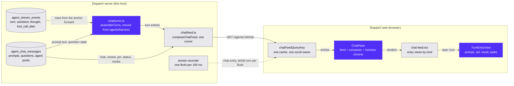

# Harness turns in the Chat feed: one surface for every agent type



**Date:** 2026-09-08.
**Status:** approved by Nii Yeboah, 2026-09-08. Q1 to Q3 decided.
**Branch:** PR #1067 on `selfcontained/dispatch` (`agt_683b115bc1e9/dispatch-harness-research`), head `01b7bba7`.
**Decides:** Nii Yeboah (scope). **Merges:** Brad Harris.
**Source:** `.superpowers/sdd/chat-harness-overlap.md`, option (b).

## 1. What and why

Brad's Chat feed gains a `turn` entry kind that carries the activity rail, the plan and the usage, so a Dispatch Harness agent reads in the same feed every other agent type reads in. The rail, the tasks strip, the prompt line and the result become entry views beside his review and pin views; the harness-only chrome (model chip, usage chip, Stop, the queue) moves into the composer. `HarnessPane`, `use-harness-turns`, the `/harness/turns` endpoint and the second cache go away.

Today a `dispatch` agent reaches a second surface behind Brad's first pill segment (`apps/web/src/components/app/agent-pane.tsx:361`), and that surface has no reviews, no pins, no presence line, no unread badge, no day dividers, no copy action and no child-agent filter. The server composes all of it and the user never sees it. Two readers walk the same two tables and produce different shapes (`apps/server/src/chat/feed.ts:509`, `apps/server/src/agents/harness/turns.ts:230`), and the client keeps two caches over one set of rows (`apps/web/src/hooks/use-sse.ts:334`, `:353`).

One feed ends that. Reviews, pins, presence, unread, the child filter, copy and day dividers work for a dispatch agent because they are already entry kinds in the same ordering, and row-level SSE replaces a whole-query refetch on every streamed chunk.

## 2. The Dispatch Harness flag

A server-owned boolean, exposed exactly like the chat-surface flag.

| Piece         | Chat surface (today)                                                                    | Dispatch Harness (new)                                                                                                                                                                                                                                                                                                         |
| ------------- | --------------------------------------------------------------------------------------- | ------------------------------------------------------------------------------------------------------------------------------------------------------------------------------------------------------------------------------------------------------------------------------------------------------------------------------ |
| Settings key  | `chat_surface_enabled` (`apps/server/src/chat-surface-settings.ts:17`)                  | `dispatch_harness_enabled`, new `apps/server/src/dispatch-harness-settings.ts`                                                                                                                                                                                                                                                 |
| Routes        | `GET`/`POST /api/v1/app/settings/chat-surface` (`apps/server/src/routes/system.ts:474`) | `GET`/`POST /api/v1/app/settings/dispatch-harness`, same shape and same `400` on a non-boolean                                                                                                                                                                                                                                 |
| Hook          | `useChatSurfaceEnabled` (`apps/web/src/hooks/use-chat-surface-enabled.ts:26`)           | `useDispatchHarnessEnabled` over `useServerFlag` (`apps/web/src/hooks/use-server-flag.ts:33`)                                                                                                                                                                                                                                  |
| Hint atom     | `chatSurfaceEnabledHintAtom` (`apps/web/src/lib/store.ts:147`)                          | `dispatchHarnessEnabledHintAtom`, same `atomWithLocalStorage`                                                                                                                                                                                                                                                                  |
| Settings card | `ChatSurfaceSettings` (`apps/web/src/components/app/chat-surface-settings.tsx:10`)      | `DispatchHarnessSettings`, label "Dispatch Harness (beta)", testid `dispatch-harness-toggle`, one sentence of description noting that turning it off stops new dispatch agents without stopping running ones (Q3: no agent list), mounted next to the chat-surface card at `apps/web/src/components/app/settings-pane.tsx:225` |

No migration. `settings` is a key/value table read through `getSetting`/`setSetting` (`apps/server/src/db/settings.ts:9`), so an install with no row reads `false`.

**The rule against `enabled_agent_types`.** `dispatch` is never a member of the persisted list. `sanitizeEnabledAgentTypes` (`apps/server/src/shared/agent-types.ts:48`) drops it on read and on write; `POST /api/v1/app/settings/agent-types` (`apps/server/src/routes/system.ts:378`) answers `400` naming the harness endpoint when a body includes it; the Settings checkbox list stops offering it (`apps/web/src/components/app/agent-type-settings.tsx:163` iterates `CLI_AGENT_TYPES`, and its `dispatch` description at `:16` moves to the new card). A new `getOfferedAgentTypes(pool)` in `apps/server/src/agent-type-settings.ts` returns `getEnabledAgentTypes(pool)` (`:22`) plus `dispatch` when and only when `isDispatchHarnessEnabled(pool)` is true. Every gate that reads the enabled list reads the offered list instead: the create route (`apps/server/src/routes/agents/crud-routes.ts:257`), `dispatch_launch_agent` (`apps/server/src/server/mcp-handlers.ts:577`), persona launches (`apps/server/src/server/mcp-review-handlers.ts:504`), the reviewer-type change (`PATCH /api/v1/agents/:id/review-agent-type`, `apps/server/src/routes/agents/lifecycle-routes.ts:45`), the plugin routes (`apps/server/src/routes/plugin.ts:33`, `:56`) and the release readiness check (`apps/server/src/routes/release.ts:718`). `DEFAULT_ENABLED_AGENT_TYPES` already excludes `dispatch` (`packages/shared/src/agent-types.ts:35`), so no install needs a data change, and the comment there moves onto the flag. So the type appears in exactly one place in Settings, and jobs, templates and the create dialog offer it from the same one source.

**Routing for a dispatch agent.** `agents-view.tsx:248` already forces the Agent pane for a `dispatch` agent whatever the chat-surface flag says, and the harness flag does not enter that expression: the flag gates creation and discovery, not a running agent. `terminalHostTab(chatEnabled)` (`apps/web/src/lib/center-tabs.ts:105`) therefore yields `agent`, so the center tabs read Agent, Changes, Whiteboard for that agent on an install with the chat surface off, and the pill still offers Console. `agentSupportsHarness` (`center-tabs.ts:92`), `harnessEnabled` (`agents-view.tsx:610`) and both of its branches in the pane (`agent-pane.tsx:119`, `:161`) are deleted, so the Chat segment is Brad's: the unread badge (`agent-pane.tsx:139`) and the child-agent filter (`:161`) come back for dispatch agents.

**The e2e helper.** `setEnabledAgentTypesViaAPI` (`e2e/helpers.ts:156`) keeps its signature and its route. Because the route now rejects `dispatch`, the helper's existing non-ok throw (`e2e/helpers.ts:165`) turns a stale call into a loud failure rather than a silent no-op. A sibling `setDispatchHarnessViaAPI(request, enabled)` posts the new endpoint, and the four calls in `e2e/harness-agent.spec.ts` (`:102`, `:193`, `:262`, `:338`) drop `"dispatch"` from the array and add it.

## 3. The `turn` feed entry

### Shape

In `packages/shared/src/chat-types.ts`, beside the other entry types:

```ts
export type ChatTurnPrompt = {
  source: "chat" | "launch" | "agent" | "system";
  text: string;
  /** The `agent_chat_messages` row behind a chat or launch prompt. */
  chatMessageId?: string;
  /** A prompt from another agent: who sent it. */
  senderName?: string;
  attachments: ChatAttachment[];
};

/** A question asked during the turn. Its card is a `chat` entry of its own. */
export type ChatTurnQuestionRef = { messageId: string; answered: boolean };

export type ChatTurnEntry = {
  type: "turn";
  /** `turn:<stream row id>`, or `turn:pre:<first row id>` for a pre-turn group. */
  id: string;
  agentId: string;
  /** The anchor row's `created_at`: the turn's place in the feed, fixed for its life. */
  at: string;
  /** The newest row folded in so far; moves while the turn streams. */
  updatedAt: string;
  prompt: ChatTurnPrompt;
  trace: {
    startedAt: string;
    endedAt?: string;
    finalResult?: "ok" | "error" | "interrupted";
    steps: ChatTurnStep[];
  };
  result: { text: string; streaming: boolean; truncated?: boolean } | null;
  /** False while the turn is open: the rail is live and the result may grow. */
  settled: boolean;
  /** Cut rather than finished: Stop, Ctrl+C, Send now, or a service restart. */
  interrupted: boolean;
  error?: string;
  /** The turn in the agent's own words: its last `dispatch_event` message. */
  label?: string;
  plan?: ChatTurnPlanEntry[];
  usage?: { used: number; size: number; costUsd: number | null };
  questions?: ChatTurnQuestionRef[];
};
```

`ChatTurnStep` and `ChatTurnPlanEntry` are today's `HarnessStep` (`packages/shared/src/harness-types.ts:20`, children included) and `HarnessPlanEntry` (`:200`), moved into `chat-types.ts` because `harness-types.ts` already imports from it (`harness-types.ts:1`) and the dependency must not turn around. `harness-types.ts` re-exports them under their current names until stage 3 removes `HarnessTurn` (`:63`) and `HarnessTurnsResponse` (`:230`). `ChatFeedEntry` (`chat-types.ts:257`) gains the member.

### Composition

`assembleTurns` and its helpers move from `apps/server/src/agents/harness/turns.ts` to `apps/server/src/chat/turns.ts` unchanged, except that a pre-turn group's id becomes `turn:pre:<first row id>` rather than the array index it is today (`turns.ts:354`), so the cursor has a real row id to compare. `loadTurns` (`turns.ts:370`) is replaced by `listTurnEntries(db, agentId, cursor, limit)`, one more source in `composeChatFeed` (`feed.ts:646`):

1. Select the newest `limit + 1` **anchor** rows past the cursor: `kind = 'turn'`, plus the oldest stream row when no turn row precedes it. `cursorClause("turn", "int", …)` (`feed.ts:148`) supplies the clause.
2. Load every row in `[oldest selected anchor.seq, first anchor above the page)`, which is `turns.ts:386` bounded at the top as well as the bottom, so paging older never re-reads the newer turns.
3. Assemble, then map each turn to a `ChatTurnEntry` with `at` from the anchor's `created_at` and `updatedAt` from the newest row's `updated_at`.

`SOURCE_RANK` (`feed.ts:50`) gains `turn: 6`, the rank `assistant` and `activity` already share, because all three come from `agent_stream_events` and the cursor's id tie-break has to stay valid across them. `isValidCursorId` (`feed.ts:73`) gains `turn` in its serial-id branch.

**Deduplication.** A chat row that is a turn's prompt is rendered by the turn, so `listChatEntries` (`feed.ts:193`) filters it out with a `NOT EXISTS` against `agent_stream_events` turn rows whose `payload.prompt.chatMessageId` matches. Every other chat row stays its own `chat` entry: an agent post, a question, an answer. The turn's `result` is an `assistant` stream row and never a chat row, so it cannot clash; the harness persona already tells the engine not to repeat a reply through `dispatch_chat_post` (`apps/server/src/agents/harness/persona.ts:13`).

### Ordering

A turn takes the position of its anchor row and grows in place. Rows from other sources created while the turn ran keep their own timestamps, so they land below the turn entry rather than inside it, and the next turn's anchor lands below them. That is the price of one entry per turn, and it is the trade option (b) accepts: the alternative is splitting a turn around every interleaved row. The one exception is the agent's own questions, which the turn references (`turns.ts:249` binds each to the latest turn that had started) while their cards render as `chat` entries in time order.

### Live updates

The recorder rewrites a row at most every 100 ms (`apps/server/src/agents/harness/stream-recorder.ts:34`) and the supervisor announces each flush through `publishHarness` (`apps/server/src/server.ts:489`). That hook also composes the affected turn and publishes one `chat.entry` (`chat-types.ts:325`) carrying the whole entry, the way a status row already does (`server.ts:441`). `upsertFeedEntry` replaces an entry by `type:id` in whichever page holds it (`apps/web/src/hooks/use-chat.ts:387`), so a turn deep in the feed updates without a refetch. One composition per flush costs one bounded query, not a feed page.

In stage 3, `harness.changed` (`chat-types.ts:311`) keeps only its `config` duty (`use-sse.ts:359`) and the queue query; its feed and turns invalidations (`:357`) go, and so do the coarse ones at `use-sse.ts:381`, `:429`, `:497`, `:528`.

### What the flat entries become

`listTurnEntries` replaces `listStreamEntries` (`feed.ts:512`) in the composer in the same change, and the `assistant` and `activity` members (`chat-types.ts:198`, `:220`) go with it, so the feed never carries a stream row twice: not as a flat entry and again inside its turn. Rows recorded before turn rows existed need no fallback: `assembleTurns` already groups them into one closed synthetic turn (`turns.ts:241`, `:338`). A stream row that arrives with no open turn does not exist in practice, because the recorder opens one itself and closes it after `AUTONOMOUS_IDLE_MS` (`stream-recorder.ts:30`).

### Paging across a turn

A turn belongs wholly to the page its anchor falls on, so no page boundary ever splits one and "Load older" cannot bring back half of a turn already shown. The newest page therefore carries the live turn entire, including rows newer than any cursor the client holds. A turn longer than `CHAT_FEED_MAX_LIMIT` rows still costs one entry; the bound that matters for it is the per-row one the recorder applies (`stream-recorder.ts:27`).

## 4. Web

`chat-feed.tsx` replaces its `assistant` and `activity` cases (`:76`, `:246`, `:496`, `:505`) with one `case "turn"` returning `TurnEntryView`, composed from the harness components under a new `chat/turn/` directory (section 6). Around it:

- **Grouping.** A `turn` entry is its own author group: `grouped` is always false, no hairline rule is drawn above it, and it resets the run so the post after it starts a fresh header. The turn renders a user post and an agent post inside one entry, so nothing outside it can group with either half.
- **Growth.** `entryGrowthKey` (`chat-feed.tsx:73`) gains a `turn` case over `updatedAt`, the step count, the result length and `settled`, which is what makes `chat-pane.tsx:358` follow a streaming turn. `entryVersion` (`:64`) is unchanged: a turn's `at` never moves, so growth does not re-fade the entry, exactly as the comment at `:58` requires.
- **Questions.** `latestOpenFreeformQuestion` in `chat-feed.tsx` is the one implementation and also looks inside a turn's `questions`; the copy over turns at `harness-pane.tsx:140` goes.
- **Post styling is the outer frame.** The prompt renders through `ChatMessageView` (`chat-entries.tsx:901`), or `AgentMessageView` (`:1104`) for a prompt from another agent; the result renders as an agent post; the rail sits between them inside the same entry. Questions render through Brad's card, and `harness/question-card.tsx` is retired.

`ChatPane` becomes the dispatch agent's pane and grows the harness-only chrome, shown when `agent.type === "dispatch"` and otherwise absent. No new prop: the pane already takes `agent` (`chat-pane.tsx:39`). The chrome is the block at `harness-pane.tsx:508`, moved into the composer region at `chat-pane.tsx:663`, in this order: the tasks strip, then the chip row (model chip `harness-pane.tsx:540`, usage chip `:582`, Stop `:599`), then the presence strip (`chat-pane.tsx:670`), then the composer (`:680`). The tasks strip stays pinned above the composer rather than becoming the newest entry (Q2). The starting screen and the login hint (`harness-pane.tsx:477`, `:495`) become a status line above the chip row, and the drop overlay (`:392`) merges with the composer's existing drop handling.

Stop and the queue keep their behavior: Enter queues behind a running turn and ArrowUp recalls the queued one (`harness-pane.tsx:296`), Stop hits `/harness/interrupt` (`apps/server/src/routes/agents/harness-routes.ts:138`), and `composerHint` (`harness-pane.tsx:64`) still drops its ArrowUp and Ctrl+C halves on a touch keyboard. The queue itself is live in-memory state, not a feed row, and today it rides on `/harness/turns` (`harness-routes.ts:93`), which stage 3 deletes. So stage 1 adds `GET /api/v1/agents/:id/harness/queue` returning `{ queued }` from `loadQueued` (`turns.ts:456`) beside the send-now and remove routes that already live at that path (`harness-routes.ts:99`, `:118`); `use-harness-queue.ts` grows a `useHarnessQueued(agentId)` query under `["harness-queue", agentId]`, its two mutations and `useHarnessInterrupt` invalidate that key instead of the turns key, and `harness.changed` invalidates it too. Stage 2's `ChatPane` reads the queue from there.

`agent-pane.tsx` loses the `harnessEnabled` prop (`:237`), both of its uses in `AgentViewToggle` (`:119`, `:161`), the unread suppression at `:85` and the pane swap at `:361`, which becomes an unconditional `ChatPane`. `agents-view.tsx` loses the computation at `:610` and the prop at `:640` and `:684`.

Mobile follows round 3 and round 5 of `docs/chat-surface-plan.md` with nothing new: the terminal toolbar shows only under Console, the pill's segments are 44 px on coarse pointers, and the chip row keeps its `pointer-coarse:min-h-11` sizing (`harness-pane.tsx:54`).

Motion divides cleanly. `motion.ts` tokens (`apps/web/src/components/app/harness/motion.ts:9`) keep governing everything inside a turn: the rail's fold (`activity-block.tsx:34`, open while running and collapsed when done), the tasks strip's height, the queue's `AnimatePresence`, the model chip's label cross-fade. Brad's `animate-chat-enter` (200 ms opacity with a 3 px rise) governs the entry's arrival and nothing inside it, so a turn that arrives does not fade twice: the rail's per-row enter runs only for rows landing after the entry mounted. `MotionConfig reducedMotion="user"` moves from `harness-pane.tsx:385` to `ChatPane`'s root, and reduced motion drops both layers, framer through `useReducedMotion` and CSS through `motion-reduce:animate-none`.

## 5. Staging

Three stages on this PR. Each leaves the branch green and shippable.

| Stage | Ships                                                                                                                                                                                                                                                                                                                                          | Gate                                                                                                                                                                                                             | What a user sees                                                                                                                                                     |
| ----- | ---------------------------------------------------------------------------------------------------------------------------------------------------------------------------------------------------------------------------------------------------------------------------------------------------------------------------------------------- | ---------------------------------------------------------------------------------------------------------------------------------------------------------------------------------------------------------------- | -------------------------------------------------------------------------------------------------------------------------------------------------------------------- |
| 1     | The flag (routes, hook, Settings card, the `enabled_agent_types` rule); `turn` entries replacing the `assistant` and `activity` entries in the feed, with the per-flush `chat.entry` upsert; `TurnEntryView` rendering them in `chat-feed.tsx` while `HarnessPane` still renders for dispatch agents; `GET /harness/queue` and the queue query | `pnpm run check`, the feed tests for the `turn` kind in place of the `assistant` and `activity` cases, the flag's server and web tests, `pnpm run test:e2e` green with the harness specs still on `harness-pane` | The Settings toggle, and `dispatch` offered only when it is on. The Harness view is unchanged                                                                        |
| 2     | `ChatPane` is the dispatch agent's pane with the composer chrome; `HarnessPane` deleted; `harnessEnabled` removed                                                                                                                                                                                                                              | `pnpm run finalize:web`, the merged `chat-pane` and `chat-feed` suites, `harness-agent.spec.ts` retargeted to `chat-pane`, the new dispatch case in `chat-surface.spec.ts`                                       | A dispatch agent reads in the Chat feed: reviews, pins, presence, unread, the child filter, day dividers and copy all appear, and the chrome sits above the composer |
| 3     | `/harness/turns`, `use-harness-turns`, the second cache and the `harness.changed` feed invalidations deleted                                                                                                                                                                                                                                   | `pnpm run check`, `pnpm run test`, `pnpm run test:e2e`, and a manual pass on an isolated `repo_dev_up` stack watching a live turn stream, settle and interrupt                                                   | Nothing changes visually. A streamed chunk updates one row instead of refetching the feed                                                                            |

## 6. Files

| Today                                                                                  | Becomes                                                                                            |
| -------------------------------------------------------------------------------------- | -------------------------------------------------------------------------------------------------- |
| `apps/server/src/agents/harness/turns.ts`                                              | `apps/server/src/chat/turns.ts`; `loadTurns` becomes `listTurnEntries`, `loadQueued` stays         |
| `apps/server/src/chat/feed.ts`                                                         | gains `listTurnEntries` as a source, loses `listStreamEntries` (`:512`)                            |
| `apps/web/src/components/app/harness/turn-stream.tsx`                                  | `chat/turn/turn-entry-view.tsx`; its own scroll follow (`:93`) deleted, the feed's is the only one |
| `harness/prompt-line.tsx`                                                              | `chat/turn/prompt-line.tsx`; the post frame comes from `ChatMessageView`                           |
| `harness/result-turn.tsx`                                                              | `chat/turn/result-turn.tsx`                                                                        |
| `harness/activity-block.tsx`                                                           | `chat/turn/activity-block.tsx`                                                                     |
| `harness/step-row.tsx`, `harness/step-detail.tsx`                                      | `chat/turn/step-row.tsx`, `chat/turn/step-detail.tsx`                                              |
| `harness/tasks-strip.tsx`, `harness/todo-list.tsx`                                     | `chat/turn/tasks-strip.tsx`, `chat/turn/todo-list.tsx`                                             |
| `harness/queued-prompt.tsx`                                                            | `chat/turn/queued-prompt.tsx`                                                                      |
| `harness/turn-shortcuts.tsx`, `harness/shortcut-row.tsx`                               | `chat/turn/turn-shortcuts.tsx`, `chat/turn/shortcut-row.tsx`                                       |
| `harness/registry.ts`, `harness/trace.ts`, `harness/contracts.ts`                      | `chat/turn/registry.ts`, `chat/turn/trace.ts`, `chat/turn/contracts.ts`                            |
| `harness/motion.ts`                                                                    | `chat/turn/motion.ts`; the tokens are unchanged                                                    |
| `harness/harness-context.tsx`                                                          | `chat/turn/turn-context.tsx`                                                                       |
| `DiffBlock`, `diffLines` in `chat/stream-entries.tsx` (`:70`, `:124`)                  | `chat/turn/diff-block.tsx`; `step-detail.tsx:5` and `registry.ts:187` import them today            |
| `harness/harness-pane.tsx`                                                             | deleted; the shell is `ChatPane`, the chrome its composer region                                   |
| `harness/use-harness-turns.ts`                                                         | deleted; the chat feed query replaces it                                                           |
| `harness/question-card.tsx`                                                            | deleted; Brad's question card renders questions                                                    |
| `chat/stream-entries.tsx`                                                              | deleted after the diff helpers move                                                                |
| `agentSupportsHarness` (`center-tabs.ts:92`), `harnessEnabled` (`agents-view.tsx:610`) | deleted                                                                                            |
| `GET /api/v1/agents/:id/harness/turns` (`harness-routes.ts:77`)                        | deleted; `GET …/harness/queue` added                                                               |

Unmoved, mounted from the composer chrome: `harness/model-picker.tsx`, `harness/usage-dialog.tsx`, `harness/use-harness-config.ts`, `harness/use-harness-usage.ts`, `harness/use-harness-queue.ts`, `harness/use-harness-commands.ts`, `harness/use-harness-paths.ts`, `harness/provider-icon.tsx`, `harness/code-block.tsx`, `harness/format.ts`, `harness/use-stream-ticker.ts`.

## 7. Tests

- **Unit, moved with their components** from `harness/` to `chat/turn/`: `activity-block.test.tsx`, `prompt-line.test.tsx`, `step-row.test.tsx`, `todo-list.test.tsx`, `registry.test.ts`, `trace.test.ts`, `motion.test.ts`.
- **Unit, merged**: `harness/harness-pane.test.tsx` and `harness/use-harness-turns.test.tsx` fold into `chat/chat-pane.test.tsx` and `chat/chat-feed.test.tsx`; `chat/stream-entries.test.tsx` keeps only its diff-helper cases, under `chat/turn/diff-block.test.tsx`; `harness/question-card.test.tsx` folds into the existing question cases in `chat-feed.test.tsx`.
- **Unit, unchanged**: `harness/model-picker.test.tsx`, `harness/usage-dialog.test.tsx`, `harness/use-harness-commands.test.tsx`, `harness/format.test.ts`, `harness/code-block.test.*`, `harness/provider-icon.test.tsx`.
- **Server feed**, in `apps/server/test/chat-feed.test.ts`, taking the assembly assertions from `apps/server/test/harness-turns.test.ts`: a turn orders at its anchor among chat, review, pin, status and media rows; a page boundary between two turns pages by anchor and repeats neither; a turn whose rows span the boundary comes back whole; a live turn upserts as one `chat.entry` carrying the whole entry; an interrupted turn carries `interrupted: true` and `finalResult: "interrupted"`; a question during a turn appears once, as a `chat` entry, referenced by the turn; a prompt chat row is not emitted twice.
- **The queue route**: a server test that `GET …/harness/queue` returns `{ queued }` for a queued prompt and `{ queued: [] }` otherwise; a new `harness/use-harness-queue.test.tsx` asserts that send-now, remove and Stop each invalidate the queue key.
- **The flag**: server tests for the two routes (default `false`, round trip, `400` on a non-boolean), for `getOfferedAgentTypes` with the flag on and off, and for the `400` when `POST …/agent-types` names `dispatch`; a web test that the Settings card writes through the same query the routing reads.
- **E2E**: the four tests in `e2e/harness-agent.spec.ts` keep the fake ACP agent (`e2e/fixtures/fake-acp-agent.mjs`, unchanged) and retarget `harness-pane` to `chat-pane` (`:123`, `:208`, `:277`, `:353`), adding `setDispatchHarnessViaAPI`. `e2e/chat-surface.spec.ts` gains a dispatch-agent case: seed a review, a pin write and a status event during a turn, then assert the review card, the pin row and the presence strip render in the same feed as the turn.

## 8. Errors and edge cases

| Case                                                                    | Behavior                                                                                                                                                                                                                                                          |
| ----------------------------------------------------------------------- | ----------------------------------------------------------------------------------------------------------------------------------------------------------------------------------------------------------------------------------------------------------------- |
| A turn cut by a service restart                                         | The recorder marks it `interrupted by restart` (`stream-recorder.ts:32`); the entry carries `interrupted: true`, `settled: true`, `finalResult: "interrupted"`, and the rail folds to its summary                                                                 |
| A queued message at shutdown                                            | The queue is in memory and is lost, as today; the chat rows behind it stay, and the startup sweep marks their delivery not-done (`apps/server/src/chat/service.ts:758`). They are `chat` entries in the feed, not turns                                           |
| An engine that publishes no plan                                        | `plan` is absent, the tasks strip stays unmounted, and the detail says the engine publishes no task list, per the engines spec's Web table                                                                                                                        |
| A prompt from another agent                                             | `prompt.source` is `agent` with `senderName` set (`turns.ts:52`); the entry renders through `AgentMessageView` with the relation chip round 3 defined                                                                                                             |
| A turn with a question                                                  | The turn references the message id and its answered state; the card renders as its own `chat` entry in time order, and unread and pending-question counts are untouched                                                                                           |
| A turn longer than the feed page                                        | One entry either way. The page limit counts entries, not stream rows, so a 400-step turn is one row of the page                                                                                                                                                   |
| Two rows sharing a millisecond                                          | The server orders on microsecond text (`feed.ts:64`), so paging is exact. The client cannot order within a millisecond and bails to a refetch (`use-chat.ts:415`), which is the existing behavior for every entry kind                                            |
| The harness flag turned off while dispatch agents run                   | Their sessions keep running, their pane stays the Agent pane with the turn feed, and `/harness/*` keeps serving them. Only creation and discovery stop: the create dialog, jobs, templates, `dispatch_launch_agent` and persona launches no longer offer the type |
| A dispatch agent that posts a reply through `dispatch_chat_post` anyway | It renders as an agent post below the turn. The persona already tells the engine not to (`persona.ts:13`); nothing dedupes text                                                                                                                                   |

## 9. Out of scope

- The engines, driver, supervisor, recorder and stream store from `docs/superpowers/specs/2026-09-07-dispatch-harness-acp-engines-design.md`, unchanged except for the composition hook in section 3.
- OpenCode's live smoke, still waiting on a provider choice (that spec's Q5).
- The tmux `claude`, `codex`, `cursor` and `opencode` types. They are unchanged and are not a design target.
- Everything in `docs/chat-surface-plan.md` rounds 1 to 5 that this does not touch: the injection envelope, launch context, draft persistence, the presence strip's signals, split-pane normalization.
- Usage budgets, the model catalog and the harness icon.

## 10. Open questions

| ID  | Question                                                                                                                                                           | Recommendation                                                                                                                   | Owner | Status                    |
| --- | ------------------------------------------------------------------------------------------------------------------------------------------------------------------ | -------------------------------------------------------------------------------------------------------------------------------- | ----- | ------------------------- |
| Q1  | Does the Console segment stay for a dispatch agent? Its terminal is a plain shell with no CLI in it, so the segment offers a shell rather than the agent's session | Keep it. A shell in the agent's worktree is useful for `git status` and test runs, and hiding the segment would be the only work | Nii   | decided: keep the segment |
| Q2  | Is the tasks strip pinned above the composer, as this draft assumes, or inline as the newest entry so it scrolls with its turn?                                    | Pinned, as drafted. The strip is the agent's current plan and belongs beside the controls, not scrolled away with an old turn    | Nii   | decided: pinned           |
| Q3  | When the harness flag is off, should the Settings card still list running dispatch agents so the flag's effect is visible?                                         | No. One sentence on the card says running agents keep running; a list would be a second agent list to keep correct               | Nii   | decided: no list          |
